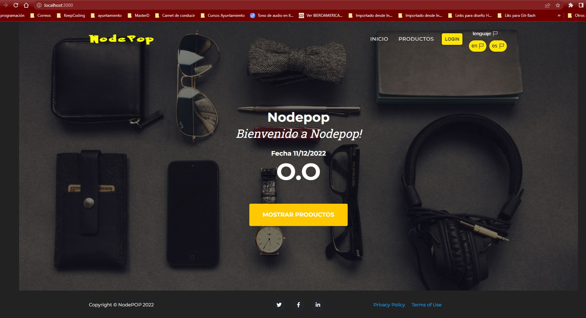
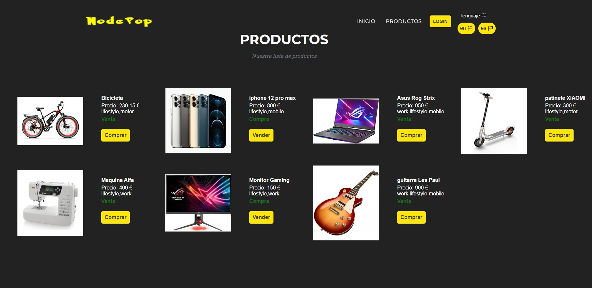

# PRACTICA - NODE-JS

[](https://github.com/VilyaTanke)

**`Angel Magallanes`**


[](https://badge.fury.io/gh/VilyaTanke%2FPractica-HTML-CSS)    [](https://badge.fury.io/gh/VilyaTanke%2FPractica-HTML-CSS) [](https://badge.fury.io/gh/VilyaTanke%2FPractica-HTML-CSS)
 [](https://badge.fury.io/gh/VilyaTanke%2FPractica-HTML-CSS) [](https://img.shields.io/badge/~~~~%3E-JavaScript-yellow)

Bienvenido, en adelante encontrara las instrucciones mediante las cuales podra hacer el uso correcto de la api Productos y que ademas vamos a poder mostrarle mediante una plantilla HTML sencilla.

debe tener en cuenta que para el correcto uso de esta API debera tener instalado Mongodb  para el manejo de la base de datos, nodejs [](https://badge.fury.io/js/graphql) para el manejo de todos los paquetes de trabajo.

--------------------------------------------------

despues de clonar el repositorio de la API, que podra hacer a través de git Bash o usando la interfaz grafica de su preferencia.

para git bash puede usar;

````
git clone https://github.com/VilyaTanke/Backend-Avanzado.git
````

luego debera hacer la instalación de Express JS usando:

````
npm i express
````

instalar correctamente los paquetes lo puede hacer con:

````
npm install
````

Antes de iniciar la app, se recomienda inicializar la base de datos con:

````
node initDB.js
````
("Debe tener en cuenta que para hacer la conexión a la base de datos sin problema, debe crear un fichero .env en la carpeta raiz de la app utilizando las variables de entorno proporcionadas en el fichero .env.example")
____

finalmente para inicializar la app usaremos:

````
npm run dev
````
posteriormente entramos a nuestro navegador e introducimos la url de:
````
http://localhost:(el puerto que tenga por defecto su ordenador)
````
si todo ha ido correctamente debera aparecer la pagina inicial de nuestra app que se veria asi:



### en la pagina de productos se vera de la siguiente forma:



## FUNCIONALIDADES:

### Crear un producto nuevo:

si desea agregar mas productos a la base de datos inicial, solo debera utilizar el metodo post a través de la plataforma postman utilizando el puerto localhost correcto donde se podra facilmente hacer la creación de los productos siempre agregando los campos correctos:

````
const productoSchema = mongoose.Schema({
    name: String,
    venta: Boolean,
    precio: { type: Number, min: 0, max: 1000000},
    foto: String,
    tags: [String]
});
````
se pueden agregar la cantidad de tags de su preferencia, de la misma manera que al realizar los filtros puede tambien filtrar cualquier cantidad de productos que coincidan con los mismos tag.
#
### A continuación encontrara los tipos de filtros para la base de datos
#

- ````Para filtrar por nombre:```` 
    - en la pagina principal:    
    ```` 
    http://localhost:3000/?name=" nombre del producto "
    ````
    - en la pagina de productos:
    ````
    http://localhost:3000/api/productos/?name=" nombre del producto "
    ````
- ````Para filtrar por tipo de venta:````
    - en la pagina principal:    
    ```` 
    http://localhost:3000/?venta=" true o false "
    ````
    - en la pagina de productos:
    ````
    http://localhost:3000/api/productos/?venta=" true o false "
    ````
- ````para filtrar por tag: ````
    - en la pagina principal:    
    ```` 
    http://localhost:3000/?tags=" mobile, motor, etc.... "
    ````
    - en la pagina de productos:
    ````
    http://localhost:3000/api/productos/?tags=" mobile, motor, etc.... "
    ````

- ````Para fines de desarrollo se ha creado tambien la posibilidad de ubicar los articulos de la base de datos por ID:````
    - en la pagina principal:    
    ```` 
    http://localhost:3000/?_id=" id del producto que se se presenta en la BD "
    ````
    - en la pagina de productos:
    ````
    http://localhost:3000/api/productos/?_id=" id del producto que se se presenta en la BD "
    ````
- ````el filtro de tipo sort sirve para realizar busquedas utilizando multiples campos````
    - en la pagina principal:    
    ```` 
    http://localhost:3000/?sort=" name, venta, tags "
    ````
    - en la pagina de productos:
    ````
    http://localhost:3000/api/productos/?sort=" name, venta, tags "
    ````

### Para configurar la paginación de los productos:

- ````Para limitar el numero de productos por pagina````
    - en la pagina principal:    
    ```` 
    http://localhost:3000/?limit=" en formato numerico, la cantidad de productos que se quiere mostrar"
    ````
    - en la pagina de productos:
    ````
    http://localhost:3000/api/productos/?limit=" en formato numerico, la cantidad de productos que se quiere mostrar"
    ````
- ````Para Ocultar una cantidad especifica de productos, basta con:````
    - en la pagina principal:    
    ```` 
    http://localhost:3000/?skip=" en formato numerico, la cantidad de productos que se quiere ocultar "
    ````
    - en la pagina de productos:
    ````
    http://localhost:3000/api/productos/?skip=" en formato numerico, la cantidad de productos que se quiere ocultar "
    ````
    - Se debe tener en cuenta que este metodo solo ocultara los primeros productos, tomando en cuenta el valor numerico indicado, empezara desde el producto 0.

- ````Estos dos metodos pueden mezclarse y de esta manera poder configurar lo que serian las psaginas a mostrar, por ejemplo:````
     - en la pagina principal:    
    ```` 
    http://localhost:3000/?skip=2&limit=2
    ````
    - en la pagina de productos:
    ````
    http://localhost:3000/api/productos/?skip=2&limit=2
